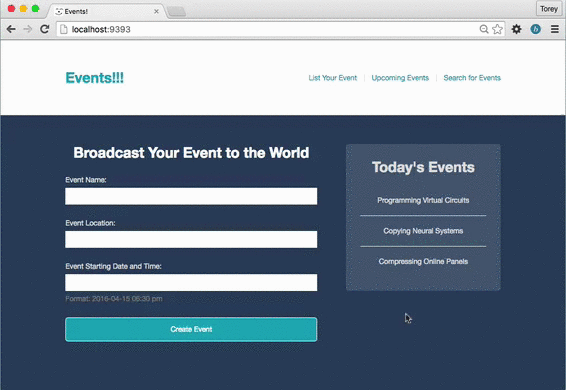

# Working with Dates and Times

## Summary
Working with dates and times can be tricky—particularly when we have to rely on user input.  Why would that be tricky?  Think about entering a date in a form field.  How many formats could the same date take?  "April 15, 1980", "15/04/1980", "4-15-80", etc.  Now imagine entering a date and time together.  How many different forms could that take?  "04-15-1980 2:00 PM", "April 15, 1980 14:00", etc.

There are tons of ways that humans represent dates.  Unfortunately, Ruby doesn't understand all of them.  We're going to look at representations of dates and times that Ruby understands and explore some options for getting user input for dates in one of these forms.


## Releases
### Release 0:  String Formats that Ruby Can Parse
We've been supplied with a CRUD app with one-resource: an `Event` model with a `datetime` attribute named `starts_at`.  Users will create events by submitting a form, so we'll be working with dates and times entered by users.  This means that the dates and times that users enter must be formatted in a way that Ruby can parse.

So, in what format must a string be for Ruby to parse it to a date and time?  One format is *[ISO 8601][]*, an international standard for representing dates and times.  There's also *JIS X 0301*, *RFC 2822*, *RFC 3339*, etc.  In other words, probably nothing that our users will enter on their own.

We won't create an exhaustive list, but let's explore a few formats to see how Ruby handles them.  Open the `rake console` and try to assign an event a starting date and time using each of the strings in Table 1.  Some will parse correctly and some won't.  See Figure 1 for a couple examples; notice that when a string doesn't parse properly, the attribute's value is set to `nil`.  Guess which formats will work before using them.  What happens if the string leaves out elements like the time zone, seconds, etc.?

```ruby
event = Event.new
# => #<Event id: nil, name: nil, location: nil, starts_at: nil, created_at: nil, updated_at: nil> 
event.starts_at
# => nil
event.starts_at = "Wed, 27 Apr 2016 17:42:41 -0500"
# => "Wed, 27 Apr 2016 17:42:41 -0500"
event.starts_at
# => 2016-04-27 22:42:41 UTC
event.starts_at = "Wed, 27 04 2016 17:42:41 -0500"
# => "Wed, 27 04 2016 17:42:41 -0500" 
event.starts_at
# => nil 
```
*Figure 1*. Assigning an `Event` a starting data and time using a string.


| Ruby String                         | Format     |
| :---------------------------------- | :---       |
| `"2016-04-28T15:32:44+00:00"`       | ISO 8601   |
| `"H14.02.03T04:05:06+00:00"`        | JIS X 0301 |
| `"Thu, 5 May 2016 04:05:06+00:00"`  | RFC 2822   |
| `"2016-04-30T04:05:06+00:00"`       | RFC 3339   |
| `"20131101T040506+0700"`            |            |
| `"16th Oct 2016 12:12:12"`          |            |
| `"15:20:45 Nov 19th 2016"`          |            |
| `"30-06-1984 17:50:00"`             |            |
| `"06-30-1984 17:50:00"`             |            |
| `"2002/04/30 20:00"`                |            |
| `"2002-04-30 14:00"`                |            |
| `"2012/10/30 16"`                   |            |
| `"2015-12-31 08:15 PM"`             |            |
*Table 1*.  Date and time formatted strings.


### Release 1: Use a `datetime-local` Input
As always, we can't trust users to provide us with clean data: we can't assume that a user will enter a date and time in a format that Ruby can parse.  So, what can we do to help users provide clean data?

As our application is currently written, we simply provide a note below our text input fields that provides an example date and time in a format that will work: *2016-04-15 06:30 pm*.  And, that might be enough for some users but probably not for all of them.

One option that we can employ to encourage better data is to use a different type of input field.  In other words, not a text input in which users can type whatever they want.  HTML5 introduced a number of new input types.  One of these types is [`datetime-local`][datetime-local].

Update the `app/views/events/_form.erb` partial to use a `datetime-local` input for collecting an event's starting date and time.  See Figure 2 for an example of how the form will behave with a `datetime-local` field.  Ensure that the input is still populated when editing an event.

  
*Figure 2*.  Using a `datetime-local` input field.


### Release 2: Use a JavaScript Date Picker
Using a `datetime-local	` input field is an improvement over the generic text input.  But! ... [not all browsers support it][support datetime-local].  If all our users are using Chrome, we're in luck, but they probably don't.

Another way to control user input of dates and times is with JaveScript date and time pickers.  While there are different date and time pickers available, our application is set up to use the [jQuery UI datepicker widget][jquery datepicker] and the [jQuery Timepicker plugin][jquery timepicker].  By "set up", we mean that all the required JavaScript, CSS, and image files have been added and included (see the `public/` directory and the `<head>` tag of `app/views/layout.erb`).

Read the documentation on how to use the date and time pickers and then update our form to use them.  See Figure 3 for an example implementation.  Again, ensure that the date and time are still populated when editing an event.

  
*Figure 3*.  Using JavaScript date and time pickers.


### Release 3: Search for Events Occurring on Specific Dates
We're going to do a little more work with dates.  We want to allow users to search for events occurring in a specific date range.  Users will supply a starting date and an ending date, and we'll return a list of events starting between the beginning of the starting day and the end of the ending date.  See Figure 4 for an example implementation.

  
*Figure 4*.  Searching for events occurring on specific dates.


[datetime-local]: https://www.w3.org/TR/html-markup/input.datetime-local.html
[ISO 8601]: https://en.wikipedia.org/wiki/ISO_8601
[jquery datepicker]: http://api.jqueryui.com/datepicker/
[jquery timepicker]: http://timepicker.co/
[support datetime-local]: http://caniuse.com/#search=datetime-local
